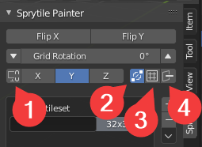
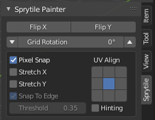
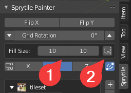
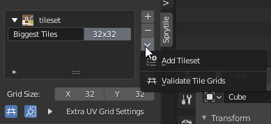
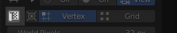
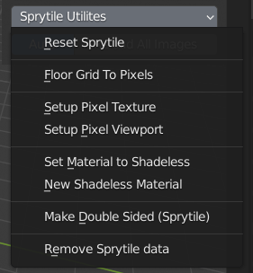

# Feature References

This page explains the settings and tools for working with Sprytile.

## Tile Palette

The tile palette appears in the viewport when Sprytile tools are in use. This lets you select the tiles Sprytile will build or paint into Blender.

**Hold shift + Middle Mouse** drag to move the palette around the viewport.

**Scroll Wheel** zooms the tile palette.

**Ctrl + Scroll Wheel** switches between tile grids.

## Main Panel

This panel contains the main controls for Sprytile's tools. When you're using the tool modes or adjusting tile grids, this is the panel you'll most likely be interacting with.

??? abstract "Build Tool Settings"

    ### Build Tool Options

    The icons and options in the build tool carry over to the other Sprytile tool modes. Refer to this section if the icon you're looking for isn't covered in the other tool settings.

    

    - Flip X/Flip Y — Flip tile orientation for placement
    - Grid Rotation — Rotate tiles for placement

    `Axis Indicator` — The `X/Y/Z` buttons light up according to the Work Plane axis. Pressing the `X/Y/Z` buttons will lock the work plane to that axis.

    1. Axis Lock Toggle — Lock/unlock the work plane to the current axis
    2. Auto-join — Placing tiles will automatically join vertices
    3. Join Multi — When building with multiple tiles selected, joins them to a single face
    4. Allow Backface — Sprytile will work with backfaces when toggled on

??? abstract "Paint Tool Settings"
    
    ### Paint Tool Options

    The paint tool options allow you to control how Sprytile will fit the tile selection onto the painted faces.
    
    

    | Option        | Description   |
    | ---           | ---                                                   |
    | Pixel Snap    | UV vertices are snapped to the pixel grid             |
    | Stretch X/Y   | Force painted faces to fit into the tile selection    |
    | Snap To Edge  | If a UV vertex is close to the edge of the tile selection, snap it to the edge |
    | Threshold     | how much the UV vertex needs to be close to the edge |
    | UV Align      | Controls alignment of painted face to the tile selection. Most relevant when stretch options are turned off. |
    | Hinting       | Selected edges will be used to indicate to Sprytile which part of the painted face is considered down |

??? abstract "Fill Tool Settings"

    ### Fill Tool Options

    

    - Fill Size - Size of fill grid
    - Lock Transforms - Keep the rotations of filled tiles

## Grid Settings

This is where you can create additional tile grids, or add new tilesets

??? abstract "Special Grid Types"

    ### 1x1 Tile Grids

    Creating a 1x1 tile grid allows the most flexibility when using Sprytile, allowing you to freely select any part of your texture for use with Sprytile's tools.

??? abstract "Grid Settings Details"

    

    Tile grids can be named in the left part of the grid selection list, to help with organizing grids.

    Pressing the `+` button will duplicate the currently selected grid, and the size can then be adjusted using the `Grid Size` input.

    The `-` button will delete the selected grid.

    Additional tilesets can be loaded using the dropdown menu.

    If the grid list starts bugging out, please use the `Validate Tile Grids` tool.

    ### Extra Grid Settings

    Selecting a grid and expanding `Extra UV Grid Settings` gives access to additional settings to tweak.

    

    **Tile Bleed**

    Bleeding is when [textures spill outside tiles](https://itch.io/t/72048/suggestion-for-accomodating-bleeding-fix) or create seams in real time engines. To address bleed, you can use the `Auto  Pad` or `Padding` settings.

    `Auto Pad` will move the UV edges inward by a subpixel amount, set by `Pad Offset`.

    `Padding` will add extra pixels to the top and sides of tiles, to allow you to manually paint in the bleed safe space.
    
    **Offset**

    Offset changes the origin of the tile grid in the tileset texture. This allows for grids of different sizes to be used in one texture without having to find a common denominator to make the grids fit.

    The origin of the offset is from the lower left corner of the texture.

    **Margins**

    Some tilesets may leave pixel gaps between tiles. You can try adjusting the padding and margin values to work with those tileset.

## Workflow Panel

??? abstract "Workflow Details"

    ### Cursor Flow

    Turning on `Cursor Flow` will automatically move the cursor to the last tile you placed, which can be useful for larger projects.

    

    ### UV Correction Toggle

    Blender 2.9 introduced UV correction, which automatically preserves UVs as you move mesh elements around. When combined with increment snapping, this gives pixel perfect UV editing in the viewport.

    
    
    When Sprytile is installed in 2.9, this toggle is available to quickly turn it on and off.

    ### Image Reload

    Pressing the `Reload All Images` will reload all images that are used by your scene, allowing you to quickly refresh textures after editing them in an external program. Toggling on `Auto` will automatically refresh the textures every second.

## Sprytile Utilities

This menu contains some helpful tools for Sprytile's workflow. This is available in Sprytile's panel under Object and Edit mode.

??? abstract "Utility Details"

    **Reset Sprytile** - If Sprytile breaks, it might be necessary to use this.

    **Floor Grid To Pixels** - Set Blender's grid subdivision to the world pixel density, useful for making Blender's incremental snap to one pixel.

    **Setup Pixel Texture** - Give textures the crunchy pixel art look.

    **Setup Pixel VIewport** - Blender's default viewport renderer has a slight color tint, for a more cinematic look. If you're only going to do shadeless rendering, this will remove the tint.

    **Set Material to Shadeless** - Convert a material to a shadeless look node network, for pixel art styles. Sprytile uses this when loading tilesets.

    **New Shadeless Material** - Create a new shadeless material

    **Make Double Sided** - If your model will be used in a context where a double sided material is not possible or will not be used, this will duplicate and flip the normals of selected faces.

    Recommended only as a finishing step, because it can make editing your model unweildy.

    **Remove Sprytile Data** - Remove any Sprytile data from your blend file, in case tools are not compatible with the data.

## Preferences

Sprytile's prefrences can be accessed through Blender's `Preferences>Add-ons` window, and searching for Sprytile.

??? abstract "Preference Details"

    ### Default Settings

    These are settings Sprytile will use when starting a new scene.

    **Pixel Density** - Number of pixels per Blender unit
    
    **Grid Size** - Default tilegrid size

    **Subpixel Padding** - The [pad offset value](#extra-grid-settings) to use, for helping with tile bleeding in engine.

    ### On Load Tileset

    Sprytile will run these utilities when a tileset is loaded.

    **Automatically Setup Grid** - Change Blender grid subdivisions to follow world pixel density.

    **Automatically Setup Pixel Viewport** - Blender's default viewport renderer has a slight color tint, for a more cinematic look. If you're only going to do shadeless rendering, this will remove the tint.

    ### On Sprytile Edit

    **Automatically swich viewport to Material Preview mode** - automatically change Blender's viewport to show material, so that the texture shows.