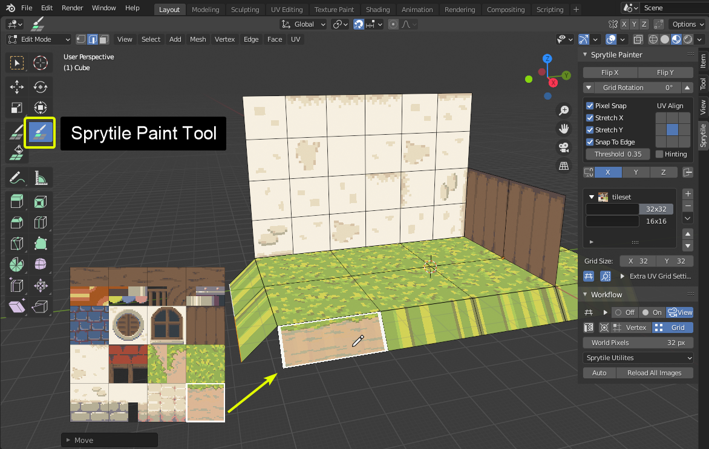
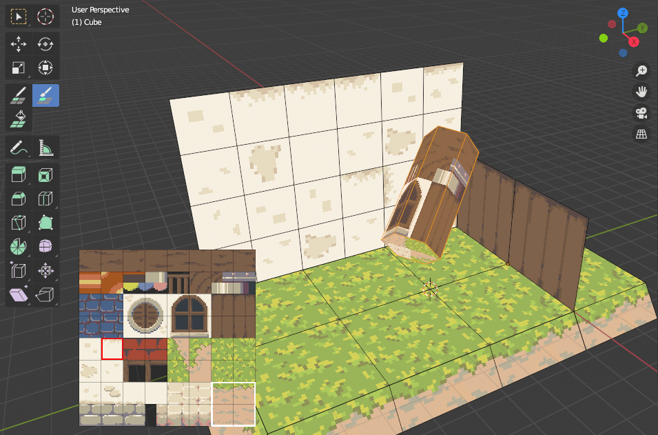
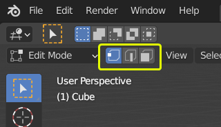
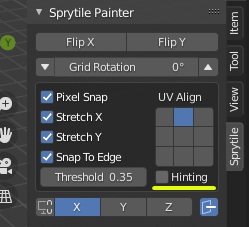
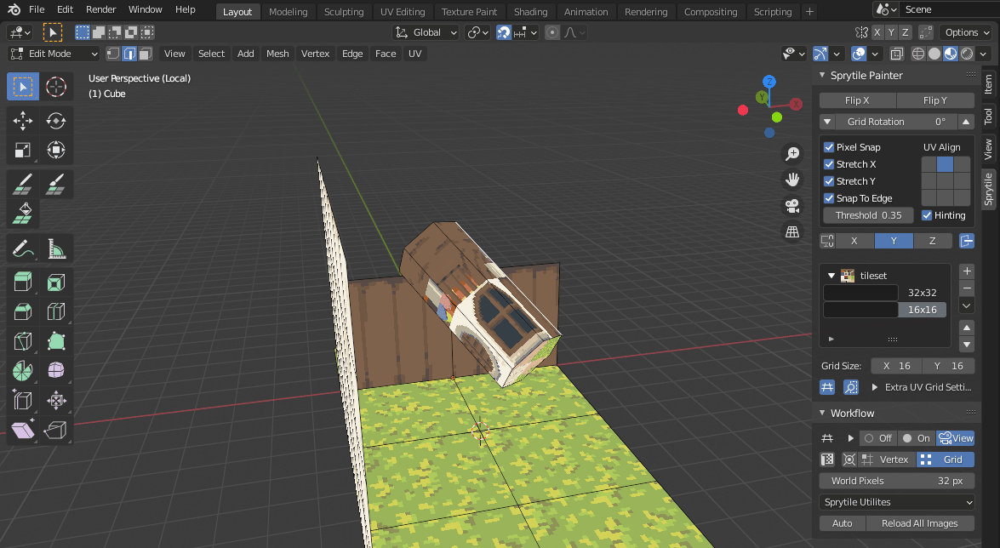

# Quick Start Tutorial

This is a short tutorial on how to use Sprytile **v0.5.2**, with Blender **2.9**. This also applies to Blender version 2.8.

This is not meant to teach beginners Blender basics, but will try to be as accomodating as possible.

We'll be using the following tile set image for this tutorial, but feel free to use your own tileset to follow along.

!!! example "tileset.png"
    

    [ *Click to download*](img/tileset.png)
    

## Installation

Download the zip file from the [itch.io page](https://chemikhazi.itch.io/sprytile). Sprytile can be downloaded for free, but donations are very much appreciated.

=== "1. Install Addon"

    In Blender, open User Preferences by going to `Edit > Preferences`. Go to the Add-ons tab and press the  `Install` button and navigate to the downloaded zip file.

    

=== "2. Enable Addon"

    After installation, make sure you enable the addon by checking the box on the top left.

    
    
    !!! note "Addon Preferences"

        There are preferences in the addon tab that you may want to change, according to your own workflow. You can always come back to these preferences when you figure out what works for you.

---

## Starting Sprytile

With Sprytile installed and setup, let's start a new Blender file by going to `File > New > General`.

In Blender 2.9, Sprytile shows up in the `Toolbar` to the **left** of the viewport, and in the `Sidebar` to the **right**.

If you don't see the toolbar on the left press ==**`T`**  to show the tools==, and if there are no panels on the right press ==**`N`** to show the sidebar==. You can also toggle them through the `View` menu.

If the Sprytile properties panel is not available in the right sidebar, make sure Sprytile is enabled in Blender's add-ons preferences.

## Sprytile Setup

Before using Sprytile tools, there are a couple of things to setup.

=== "Loading Tilesets"

    Sprytile needs to know the textures it is working with. Go to the Sprytile panel in the right sidebar and press `Load Tileset`. Choose the tileset texture and the material and texture are automatically setup. If you are using more than one tileset, use the `Add Tileset` button to make additional materials.

    

=== "Viewport Setup"

    The default Blender viewport settings can make your textures look duller than intended. If you won't do any advanced rendering in your scene, you may want to use `Setup Pixel Viewport` in the Sprytile Utilities dropdown. There is an option in the Sprytile addon preferences to always use this setting.

    

---

Most of Sprytile's tools are accessed under `Edit Mode` of a **mesh object**. Select the default Blender cube, and enter edit mode by pressing the `Tab` key.

## Build Tool ##

The build tool creates faces that are UV mapped to the selected tiles. Open Sprytile's tile map mode by pressing the `Sprytile Build` tool. The tile palette will appear on the lower left corner of the viewport, indicating that Sprytile is active.

If the palette is hidden by the toolbar, ==move the tile palette== by putting your mouse in the tile palette and holding the **shift key**. The scroll wheel ==zooms the palette in and out==.

Exit the build tool by going into any of Blender's other tools. Pressing the `W` key will take you to Blender's select tool.

First, delete the existing vertices of the cube so we have a blank slate. Do this by pressing `A` to select all, and then pressing `X` and selecting `Vertices`.

Sprytile's workflow revolves around Blender's 3D cursor and the direction the 3D view is facing.

The 3D cursor is the center of the tile grid when you're painting, and the global axis that the view is facing is the surface you will be painting on.

Let's start by reseting the 3D cursor to the center of the scene by pressing `Shift + S` and selecting `Cursor to World Origin`.

While in the build tool, try rotating the 3D view camera around. Hold down the middle mouse button while the mouse cursor is in the 3D view and move the mouse.

Notice that a grid appears around the blender 3D cursor. This is called the ==work plane== and indicates the plane that you'll be placing tiles onto.

By default, the work plane appears when the view camera is panned. If it does not show up, [check the settings](/advanced-features/#work-plane-cursor).

Tilt the camera downwards so that the work plane is aligned to the ground.

In the tile palette, choose the grass tile and paint around the 3D cursor. The grid is centered around the 3D cursor and the painted tiles appear on the ground, as shown by the work plane.

Now pan the camera up so the work plane is vertical. Pick a wall tile and paint with the tile.

Since the 3D cursor is an important part of the Sprytile workflow, you can ==move the 3D cursor== to the vertex nearest the mouse cursor by ==holding down the **`S`** key== while using Sprytile's tools.

Try facing the 3D view to the last axis you have yet to build on, then moving the 3D cursor by holding down the `S` key and moving your mouse. Paint on that axis. Note that the center of the grid has moved to where you have positioned the cursor.

### Tile Grids

With the basics of building done, let's look at tile grids. Tilesets might be made up of tiles in different sizes. Sprytile uses the concepts of tile grids to allow for this. This part of the Sprytile panel allows you to create and organize the grid settings used with the tile map.

Press the `+` button at the panel and select the newly created entry. The settings for this new tile grid can be changed in the boxes below. For the new grid, lets change it to a 16 x 16 tile size.

## Fill Tool

Looking closely at the last wall we created, the texture repetition is obvious. We'll use the smaller 16x16 tile grid we just made to break up the pattern.

Exit the build tool if you haven't done so yet, and delete the faces of wall we just created.

??? question "For Blender Newbies"

    To delete faces in Blender, go into the tweak/select tool by pressing `W`.
    
    Go into face mode by pressing the `3` key. Select the faces to be deleted.
    
    Delete them by pressing either `X` or `Del`, and then choosing faces in the menu that appears.

    Bonus tip: holding `shift` adds or removes to your selection. Holding `ctrl` will select the shortest path from your last selection to the new selection. Blender has powerful selection options worth exploring yourself.

To recreate the wall, we'll use the Sprytile fill tool. Select the fill tool from the toolbar, making sure the 16x16 grid is selected. The work plane has become bigger, showing the area the tool will fill.

The default fill size is a bit large, let's adjust it in the options to a more reasonable 6x4 grid. This part of the Sprytile panel is where the settings for Sprytile tools can be adjusted.

As with other Sprytile tools, the fill tool is centered around Blender's 3D cursor. Holding the `S` key will snap the cursor to vertex nearest to the mouse, but there are no verts where we want to move the fill tool to. We can instead use the grid snap mode in the workflow panel.

Set cursor snap to grid, and then hold down the `S` key to move the work plane with your mouse. Position the fill plane to where you want to build the wall, select the wall in the tile palette, and click inside the fill plane.

## Tile Flipping/Rotation

To address the obvious tiling on the wall we can go back to the build tool and paint over the wall, but this time using tile rotations and flipping to break up the pattern.

The highlighted part of the Sprytile panel will rotate or flip tiles when you paint. You can use the keyboard shortcuts ==`Q`/`E` to rotate the tiles== to the left or right. ==Shift + `Q`/`E` will flip the tiles== vertically or horizontally.

Repaint the wall using the tile flipping and rotation options.

!!! info "Tile Picker"

    You can pick tiles from your scene like in Photoshop. Hold down the `Alt` key and select a tile from the scene with a left mouse click.

## Paint Mode ##

Finally, we'll cover paint mode. Paint mode gives you tools to quickly UV map faces to tiles, allowing you to build your mesh with other Blender tools. Let's extrude the edges of the grass without using tile map mode so that the geometry isn't on the pixel grid anymore.

Next, use the Sprytile Paint tool and with the 32x32 tile grid, select the tile that is the border of the grass and the ground and paint onto the new edge we created.

The texture appears stretched because of the current paint settings. We can correct this by using these settings in the Sprytile tool panel. These options only appear for Paint mode.

Paint mode is dependent on the angle of your viewport. Try to rotate the camera so you're facing the front of the face you're painting on. 

### Advanced Painting ###

Paint mode allows for easy UV mapping even when the face is not aligned to the global XYZ axis.

Create a low poly cylinder and rotate it so it is not aligned to the global XYZ axis.

??? info "For Blender Newbies"

    Pressing `Shift+A` will bring up the add object menu. Choose cylinder, and set sensible settings for the cylinder.

    Move objects by pressing `G` and moving your mouse, and pressing `R` will rotate objects. 

Switch to the 16x16 tile grid and select orange metallic tile. Try to paint the sides of the cylinder. It may be difficult to be consistent because of the rotation of the cylinder.

Switch to edge selection mode and select one of the cylinder's edges along the long side. In Sprytile's setting panel, turn on hinting and then try painting the cylinder again.

??? info "For Blender Newbies"

    Inside the mesh edit mode, you can switch between 3 different subobject selection modes: Vertex, Edge, and Face.

    These are the components of a mesh. You can switch between them in this part of the viewport, or by pressing the `1` (Vertex), `2` (Edge), or `3` (Face) keys.

    

Paint on the sides of the cylinder again, and now the paint direction is consistent.

Hinting tells Sprytile which side of the painted face should be considered the bottom side of the tile.

## Conclusion ##

This tutorial gives an overview of Sprytile's basic functions, hopefully enough to help you to start building cool things with it.

If you have any questions, feel free to contact me on [twitter](https://twitter.com/jeielvtx) or via the [itch.io discussion boards](https://chemikhazi.itch.io/sprytile/community).

### Additional Tutorials

Here are some video tutorials that cover Sprytile or low poly pixel modeling inside Blender 2.8+

- [Games From Scratch, Sprytile 0.5 Tutorial](https://www.youtube.com/watch?v=pBHp7FlDWgw)
- [Mort Low Poly Pixel Workflow (some Sprytile)](https://www.youtube.com/watch?v=RQVAUaSUP-k)