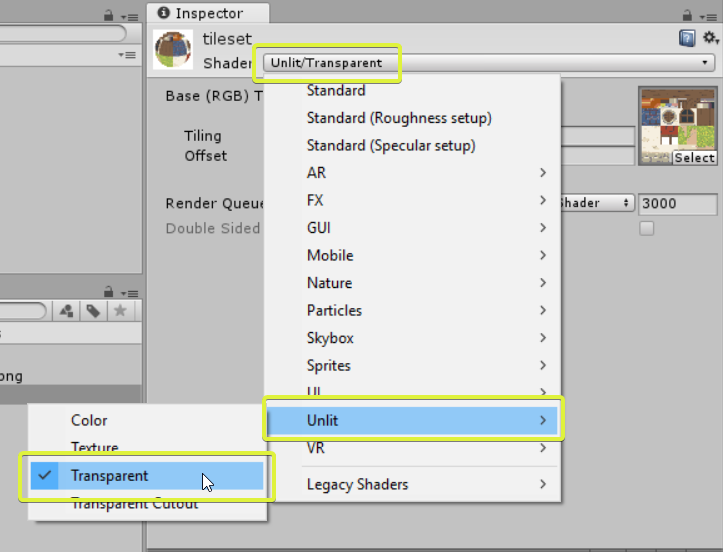
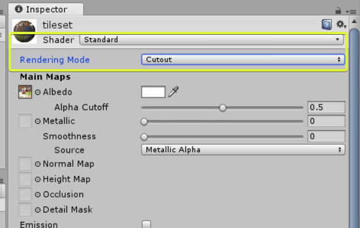
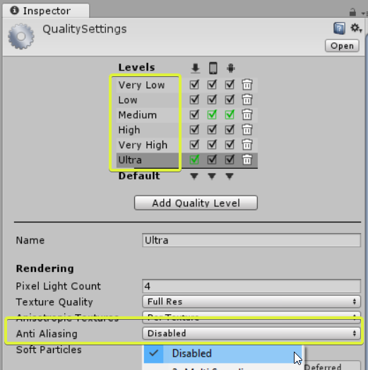

Models created with Sprytile are compatible with the [Unity3D game engine](https://unity3d.com/), but need to use certain settings to achieve a specific look.

These settings should be considered starting points for your projects, you should experiment with these to make your game visuals unique.

## Retro/Pixel Art

When using low res pixelart tilesets we'll can use the settings below for textures, materials and rendering to achieve that old school look.

### Texture

Textures should be set to the following settings:

* Generate Mip Maps: Off
* Filter Mode: Point (no filter)

### Material

When importing a `.blend` file into Unity, a material asset will be created for each material in the Blender scene.

Materials decide how your mesh will be rendered. The simplest Unity material to use is the Unlit Transparent texture, which
will render your models similar to how you see it in Blender. However, this material cannot be affected by lights.

If you'd like to use lighting in your scenes, you can use the Standard shader set to the cutout rendering mode. This material can be a bit more complex to work with, but can be lit in interesting ways.

### Camera and Anti Aliasing Settings

You may notice seams appearing in the textures of your models in Unity. The easiest way to fix this is to turn off anti-aliasing in the camera or quality settings of your project.

To disable anti-aliasing in the camera, select your camera object and turn off Allow MSAA.

To turn off anti-aliasing in the project level, open the project quality settings by going to `Edit > Project Settings > Quality`. In every quality level, disable anti-aliasing.

