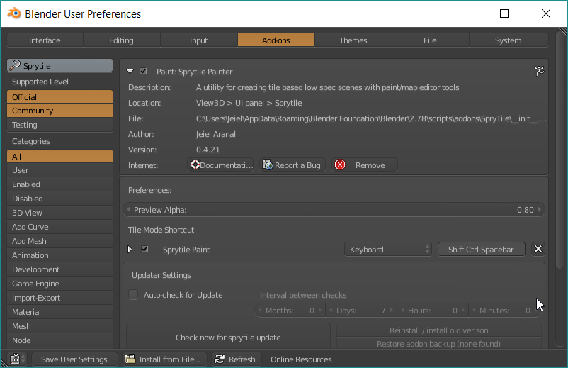
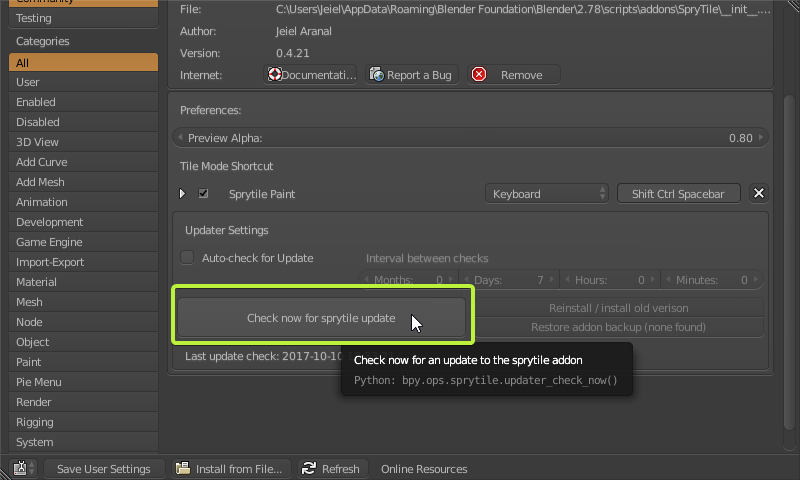

# Updating Sprytile

Sprytile is undergoing continuous development and updates are released on a regular basis. Sprytile uses the [Blender addon updater](https://github.com/CGCookie/blender-addon-updater) to help keep your installation updated.

To update Sprytile, open Blender's User Preferences window (`File > User Preferences`) and switch to the Add-ons tab.

In the Add-ons search, type `Sprytile` and expand the Sprytile Painter entry.

Scroll down to the Updater Settings and press the button marked `Check now for sprytile update`

Press this button and a check will be made for a new version. If there is an update, this button will change to allow you to update to the latest version.

Press the update button and the latest version of Sprytile will be downloaded and installed automatically. Restart Blender when you are prompted to do so by the updater and the latest version will be installed when you open Blender next.